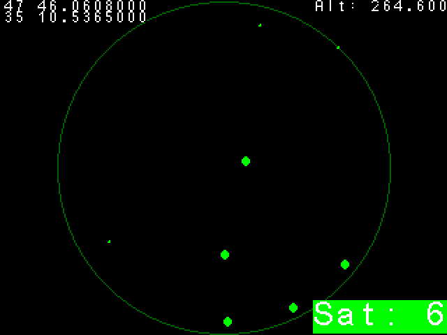

# NMEA demo application for STM32 F4VE board

This application reads NMEA messages from a GPS receiver and displays related
information on the screen.

## Requirements

* STM32 F4VE development board
* Any GPS module with UART interface
* Compatible LCD display/touch panel included in the kit
* Development environment compatible with STM32F4 microcontrollers

## Setup

* Attach GPS receiver by UART to PA10 (RX), (PA9 (TX) - optional).
* Attach the LCD display to the designated port on the STM32F4VE board.
* Connect the STM32 F4VE board to your development environment.

## Usage

Compile and upload the program to the STM32 F4VE board. Upon successful upload,
the demonstration program will run, displaying sensor data on the LCD screen.

## Scheduling analysis

| Task name      | Task type | Period | Deadline | Priority |
| -------------- | --------- | ------ | -------- | -------- |
| main (gui)     | periodic  | 200ms  | 200ms    | 120      |
| Interrupt Task | sporadic  | 21us   | 21us     | 240      |
| GPS Updater    | sporadic  | 564us  | 564us    | 125      |

If UART has a baudrate of 460800, then one byte takes 21μs (one start bit,
one stop bit, data 8 bits, so 10 bits/460800). If shortest NMEA message
length is 26 bytes then we can have a new sentence every 564μs.

| Protected object | User task      | Ceiling priority |
| ---------------- | -------------- | ---------------- |
| Line buffer      | Interrupt Task | 240              |
|                  | GPS Updater    |                  |
| GUI State        | main (gui)     | 125              |
|                  | GPS Updater    |                  |
